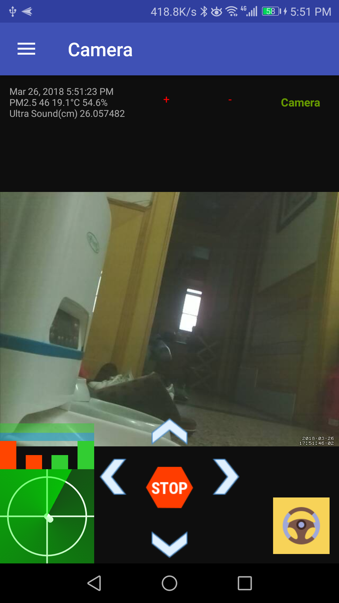
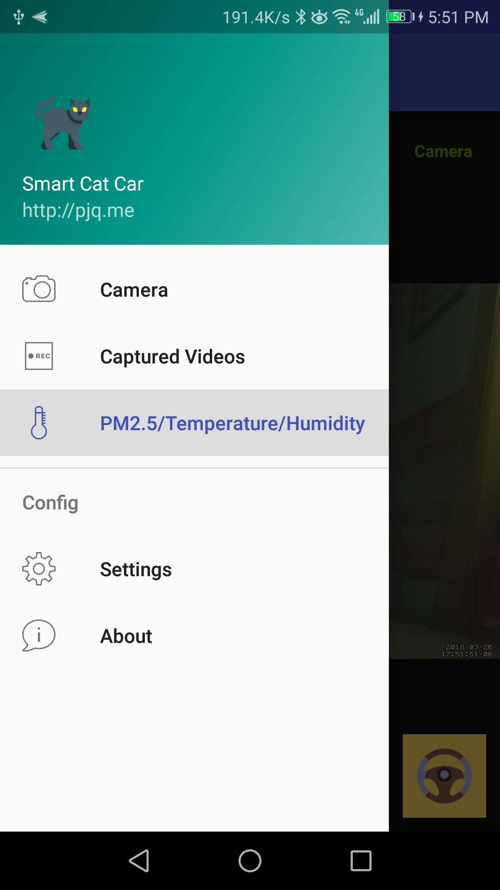
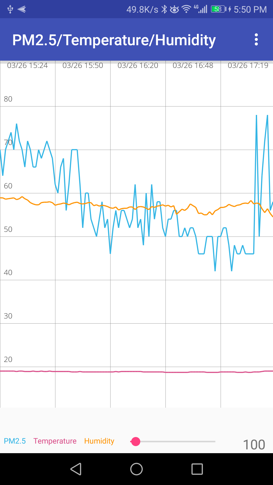
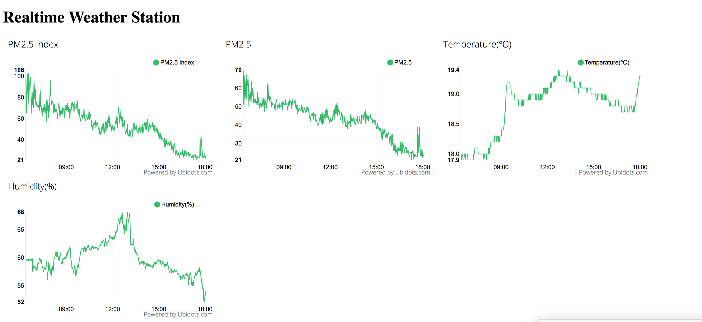

## Build your IoT on the Raspberry Pi

I have bought the Raspberry Pi in the year 2012, almost at the time when the mini board came to the world.
I have used it as media center by installing XMBC/OpenElec, NAS, and also work as one robot to post message to sina weibo and Twitter.
But somehow I almost retired it, because it's bit slow and I have the new TV box based on Android, and it can meet my requirements for play video/TV Show. 
And I have bought the Xiaomi Router, it works good, and cover my NAS requirements.

But the time is changing, the Google has just release the Android Things for development Internet of Things with more convenient tools, SDK, IDE.
And of couse the Raspberry Pi 3 has release in 2016, and from the spec, it is fast and have good performance to work as the daily development for fun.

So I buy the new one, and now I have many hardwares for play with
* Raspberry Pi 1
* Raspberry Pi 3B
* Some LEDs
* PMS5003T sensor about the air quality, like pm2.5, temp, humidity, etc.
* MG90S, micro servo
* PL2303, USB to TTL
* Breadboard
* Lines
* Motors

### Car on Raspberry Pi
Currently, I am working on the smart car on Raspberry Pi, I build:
* The controller for the GPIO, so it can be used to control the motor engine forward/backward
* I use pwm to controller the speed of the motor engine
* I use camera, so I can see the real time video stream
* I build one Android App, so I can use it to control the car without the computer.
* I use some ssh forward commands, so I can control it or see the video stream even I am at office 
* Send SMS to my phone
* Obstacles detection
* Ultrasound detection
* Record video if any motion detected.
* Turn off the battery supply if no command received for certain period.

#### Tools
I have written some scripts to run/monitor my car.
They are very import for understanding how it works

* autoforward.sh // It is used to forward some ports from the local raspberry pi to my remote VPS.
* autostart.sh  // Put all the start things when start the raspberry pi.
* capture_image.sh // Capture image
* capture_video.sh // Capture video
* deploy_server.sh // Auto pull the latest code from github, and compile it and then restart the SpringBoot server.
* monitor.sh // Monitor the port forward
* ssh_forward.sh // Forward the local port to remote server
* start_video_stream.sh // Start the video stream, then you can open it with mplayer

#### Android App
I have develop one Android App to control my car, it support
* Left/Right/Up/Down
* Adjust the speed of the car
* Adjust the camera angel
* Support auto driven on my tracks
* etc.

#### Android App Screenshots 




### Realtime Weather Station
I have already built one simple realtime weather station, to provider the PM2.5/Temperature/Himidity, please check
* http://rpi.pjq.me/

I will start to learning followings
* Learning GPIO, learn the basic usage about how to control them
* Micro Servo, learn how to control it
* Step motor
* USB and serial port communication, USB to TTL
* Sensors, read data from some sensors, like temperatioin, humidity, and also them air quality, like pm2.5

#### Weather Station Demo



### GPIO Python

Refer http://www.cnblogs.com/rainduck/archive/2012/09/22/2694568.html

1. Download Rpi.GPIO http://pypi.python.org/pypi/RPi.GPIO/
2. sudo apt-get install python-dev

```
  tar xvzf RPi.GPIO-0.x.xx.tar.gz
  cd RPi.GPIO-0.x.xx
  sudo python setup.py install
  sudo easy_install -U RPIO
  sudo rpio -I
```


### PMS5003T
Dump the binary data with od

The hex data will be like as the following format
```
#ttyAMA0:0042 004d 0014 0022 0033
#ttyUSB0:4d42 1400 2500 2f00
```

#### Debug the hex data
```
sudo od /dev/ttyAMA0
sudo od -Ax -tcx1 /dev/ttyAMA0
sudo xxd /dev/ttyAMA0
```

The hex data will be like
```
00 42
00 4d
00 1c
00 0a
00 0f
00 10
00 0a
00 0f
00 10
08 5e
02 6c
00 4b
00 05
00 e7
01 05
91 00
03 9f
1c 00
0a 00
0f 00
10 00
```
#### Run PMS5003T Script

Run the python script, and it will print the details
```
  cd pms5003t
  sudo ./g5.py
```
And the result will be like
```
Mon Feb 27 14:51:02 2017 pm2.5: 36 pm2.5(cf): 40 pm1.0: 26 pm10: 43 temp(c): 22.8 humi(%): 18.0 version: 145 error: 0
Mon Feb 27 14:51:04 2017 pm2.5: 36 pm2.5(cf): 41 pm1.0: 26 pm10: 44 temp(c): 22.7 humi(%): 17.9 version: 145 error: 0
Mon Feb 27 14:51:09 2017 pm2.5: 36 pm2.5(cf): 41 pm1.0: 26 pm10: 44 temp(c): 22.8 humi(%): 18.0 version: 145 error: 0
Mon Feb 27 14:51:15 2017 pm2.5: 36 pm2.5(cf): 41 pm1.0: 26 pm10: 43 temp(c): 22.7 humi(%): 17.9 version: 145 error: 0
Mon Feb 27 14:51:20 2017 pm2.5: 37 pm2.5(cf): 42 pm1.0: 26 pm10: 45 temp(c): 22.7 humi(%): 18.1 version: 145 error: 0
Mon Feb 27 14:51:26 2017 pm2.5: 38 pm2.5(cf): 44 pm1.0: 27 pm10: 46 temp(c): 22.7 humi(%): 18.0 version: 145 error: 0
```

### Android Things
Android Things on Raspberry Pi 3
