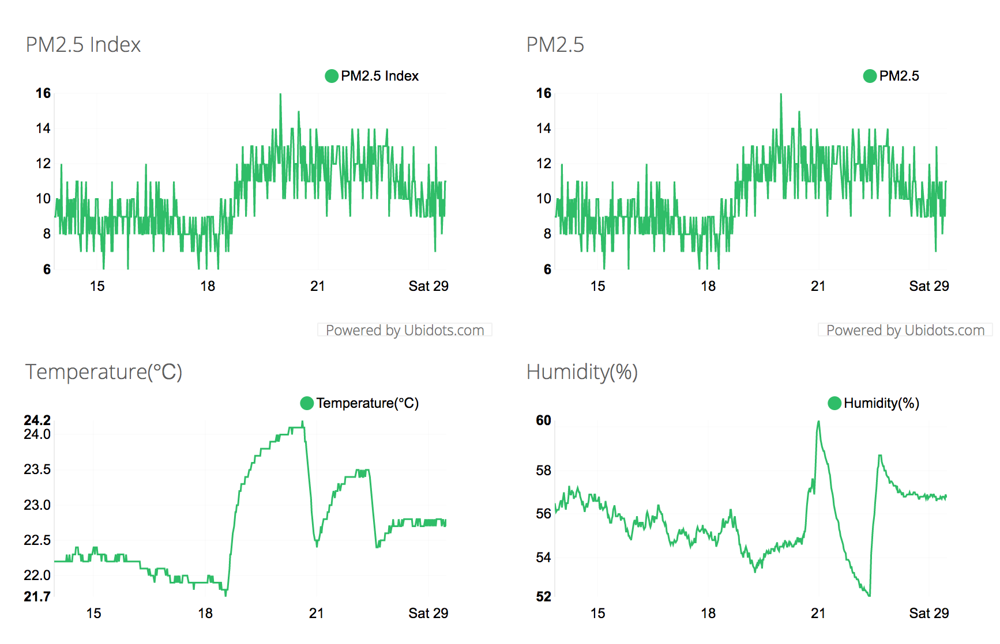
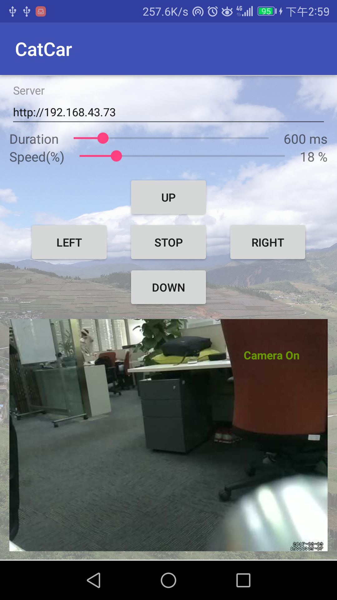

#### Raspberry Pi Car

Currently, I am working on the smart car on Raspberry Pi, I build:

* The controller for the GPIO, so it can be used to control the motor engine to **forward/backward/left/right**
* I use PWM on the GPIO pins to control the **speed** of the motor engine
* I use camera, so I can see the **real time video stream**
* I build one **Android App**, so I can use it to control the car without the computer.
* I use some ssh forward commands, so I can control it or see the video stream even I am **at office** or **at home**

So from **anywhere/anytime** you can access your Car, control it and streaming it. I also develop the auto-driven
application, but not works perfectly, still need more time to improve it.

* It use `Ultrasonic Sensor` to detect the obstacle distance, so it can decide stop or back.
* It use `Obstacle Avoidance Sensor` to detect some obstacles are closely, so it can decide to turn left/right/back.

And mostly important thing is to **make your pets happy** if you have, it because I have one cat, so I build it, just
for kidding.

#### Purpose

I think boys have the dream that one day they can control the Robot when they are in childhood. So I think the days are
coming, there are lots of chips, lots of softwares, lots of tools can help you to do that. And with mobile phone you can
do anything.

So I build the car with lots of sensors and it can be controlled anywhere if you have network.

#### Hardware

* Raspberry Pi 3
* Motors * 4
* Batteries
    * 18650 * 3, 2600ma, for Motors
    * Power Bank, for Raspberry Pi
* Car elements
* L298N, used to driven the Motors
* Camera, 500m
* Obstacle Avoidance Sensor * 4
* Ultrasonic Sensor
* PMS5003T, Air Quality(PM2.5/PM5/PM10..)/Temperature/Humidity Sensor

#### Screenshots/Demo

##### Screenshots

The real time `Air Quality` screenshot, it will the

* PM 2.5
* Temperature
* Humidity
  

Android App


Here are the screenshots for the car

##### Demo

Here are some video demos, let's see how it works magically.
[Video Demo](../demo/SmartCarOnRaspberryPi_JianqingPeng.mp4)

#### Technology

This part will do some basic introduce about technology used to build it

* Raspberry Pi
* Python Controller Code
    * The code for the car controller
    * Some Tools
    * Air Quality Sensor PMS5003T
    * Server, running with Spring Boot/MySQL
    * Motion, for video streaming
    * Android App

##### Raspberry Pi

The raspberry pi running on the official system:

```
pi@raspberrypi:~ $ uname -a
Linux raspberrypi 4.9.35-v7+ 1014 SMP Fri Jun 30 14:47:43 BST 2017 armv7l GNU/Linux
```

##### Python Controller Code

###### The code for the car controller

```
├── car
│   ├── README.md
│   ├── auto_car.py
│   ├── controller.py
│   ├── down.py
│   ├── left.py
│   ├── obstacle.py
│   ├── right.py
│   ├── speed.py
│   ├── stop.py
│   ├── ultrasound.py
│   └── up.py
```

###### Some Tools

```
└── tools
    ├── autoforward.sh
    ├── autostart.sh
    ├── capture_image.sh
    ├── capture_video.sh
    ├── monitor.sh
    ├── ssh_forward.sh
    ├── start_video_stream.sh
    └── weathers
```

###### Air Quality Sensor PMS5003T

```
├── pms5003t
│   ├── g5_oririal.py
│   ├── hex.dump
│   ├── index.html
│   ├── monitor.sh
│   ├── od.dump
│   ├── od_hex.dump
│   ├── send.py
│   ├── weather_sensor.py
│   └── xxd_hex.dump
```

###### Server, running with Spring Boot

The main controller code is in `CarController.java` and `RpiWeatherApiController.java`

```
├── README.md
├── pom.xml
├── src
│   └── main
│       ├── java
│       │   └── me
│       │       └── pjq
│       │           ├── RFC3339DateFormat.java
│       │           ├── Swagger2SpringBoot.java
│       │           ├── api
│       │           │   ├── ApiException.java
│       │           │   ├── ApiOriginFilter.java
│       │           │   ├── ApiResponseMessage.java
│       │           │   ├── NotFoundException.java
│       │           │   ├── PetsApi.java
│       │           │   ├── PetsApiController.java
│       │           │   ├── RpiWeatherApi.java
│       │           │   └── RpiWeatherApiController.java
│       │           ├── car
│       │           │   └── CarController.java
│       │           ├── configuration
│       │           │   ├── HomeController.java
│       │           │   └── SwaggerDocumentationConfig.java
│       │           ├── model
│       │           │   ├── CarAction.java
│       │           │   ├── ErrorModel.java
│       │           │   ├── NewPet.java
│       │           │   ├── Pet.java
│       │           │   └── RpiWeatherItem.java
│       │           └── repository
│       │               ├── CarActionRepository.java
│       │               ├── PetsRepository.java
│       │               └── RpiWeatherRepository.java
│       └── resources
│           └── application.properties
├── swagger-spring.iml

```

###### Motion, for video streaming

I use [Motion](https://github.com/Motion-Project/motion) for the video streaming, it support record the video if
something is moving.

###### Android App

In Android, I use

* Retrofit
* RxJava
* RxAndroid
* Realm

```
app/src/main/java
`-- me
    `-- pjq
        `-- rpicar
            |-- CarAction.java
            |-- CarControllerApi.java
            |-- CarControllerApiService.java
            |-- DataManager.java
            |-- MainActivity.java
            `-- Settings.java

```


